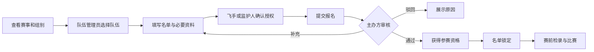
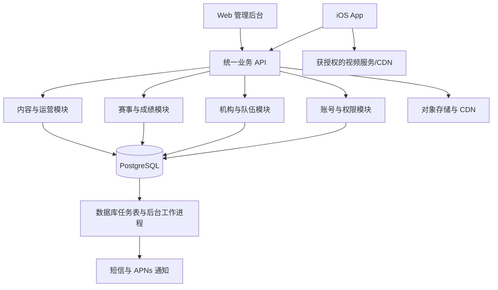

# 无人机足球平台｜产品与开发文档

版本：v0.1 评审初稿\
日期：2026-09-06\
产品名称：暂定“无人机足球”，正式品牌待定\
交付范围：iOS App + Web 管理后台 + 统一后端\
适用对象：产品负责人、UI 设计师、iOS/Web/后端工程师、测试与赛事运营人员

> 本文用于确定产品边界、讨论开发方案和估算工作量。用户已确认“多俱乐部与赛事平台”定位，并明确 iOS App + Web 后台 + 后端的平台形态及截图参考；其他功能取舍、技术栈、规则设计与排期均为建议，尚未构成已确认需求。本文不包含应用代码，也不代表已完成真实用户调研或竞品后台调查。

## 1. 产品结论与基础假设

建议做一款以“参赛与成长”为核心的无人机足球平台：用户能找到队伍，队伍能参加赛事，主办方能完成报名审核、赛程发布与成绩确认，飞手能积累可追溯的参赛记录。

系统确实可以拆成用户提出的三个部分。Web 后台同时服务平台运营、机构、主办方和裁判，各角色使用不同菜单与数据权限；无需在首期另做独立裁判 App。

| 项目 | 初稿假设 | 对开发的影响 |
| --- | --- | --- |
| 服务对象 | 已确认多俱乐部与赛事平台；学校作为拟支持机构类型 | 数据需按机构、赛事和角色隔离 |
| 首发市场 | 中国大陆，简体中文 | 考虑本地短信、内容运营、备案及上架准备 |
| 首发终端 | iPhone；建议最低 iOS 17，立项时验证目标用户设备 | 首期采用原生 iOS；Android 暂不计入交付 |
| 首期收费 | 免费报名赛事；收费能力后续单独立项 | 首版不建订单、支付、退款与分账系统 |
| 赛事规则 | 先支持一套经主办方确认的规则及有限字段配置 | 不声称适配所有协会、所有赛事规则 |
| 成绩来源 | 获授权的工作人员人工录入、复核发布 | 不依赖无人机、计分器或传感器接入 |
| 视频来源 | 主办方提供有播放授权的直播源和回放 | 首期只做观看，暂不做用户开播 |
| 未成年人 | 支持监护人管理飞手档案 | 登录账号与参赛人员分开建模 |
| 与现有业务关系 | 作为独立新产品规划 | 是否连接已有俱乐部系统另行确认，不默认复用账号或数据库 |

如果近期同时推出 Android 是硬要求，应在客户端开发前重新选择跨平台方案。多俱乐部定位已确认，首期应保留机构隔离与主办方管理；试点规模可以较小，但不能用单一管理员共享全部私有资料代替权限设计。

## 2. 截图参考与改造方向

分析仅基于用户提供的 10 张截图。可见页面不等于已验证交互；截图中的实名认证、报名和开播入口，不能证明其后台规则与实现方式。

| 截图 | 可见内容 | 无人机足球中的对应设计 | 建议阶段 |
| --- | --- | --- | --- |
| 01 首页 | 搜索、招人、找队、约赛、志愿者、客服、专题 | 搜索赛事/队伍/机构；快捷入口；赛事与入门内容 | P0；志愿者 P1 |
| 02 球队招人 | 地区、位置、人制、水平、出勤时间、联系方式 | 战队招募；地区、设备级别、适用组别、训练时间 | P0 |
| 03 球员找队 | 个人列表、意向条件、联系入口 | 飞手找队；成年人或监护人发布意向 | P0 |
| 04 平台约赛 | 时间、地点、人制、费用、队伍 | 训练约赛；设备级别、规则版本、场地与双方确认 | P0 基础版 |
| 05 志愿者 | 活动列表与结束状态 | 赛事志愿者招募、审核、签到 | P1 |
| 06 赛事列表 | 热门分类、地区、报名/进行中状态 | 按城市、设备级别、年龄组和状态筛选 | P0 |
| 07 赛事详情 | 报名、规程、赛事信息、参赛球队 | 增加检录说明、赛程、分局成绩和规则版本 | P0 |
| 08 生涯 | 比赛、赛事、球队、视频、等级、勋章 | 飞手参赛档案、实际出场、战绩、相关回放 | P0 基础档案；等级/勋章 P1 |
| 09 直播 | 专题、预告、录像、发起直播 | 主办方直播预告、授权播放、比赛回放 | P0 观看；开播 P2 |
| 10 我的 | 个人资料、实名认证、客服、反馈、设置 | 账号、身份、监护档案、通知、申请记录、注销 | P0 |

设计上保留“明确的底部导航、卡片列表、状态标签、详情页主按钮”。重做品牌、图标和素材，不把足球协会标志、球队图片或竞品插画作为本产品正式资源。

足球中的前锋、后卫、人制不能直接照搬。无人机足球应围绕飞手、队伍、设备级别、比赛角色和赛事规程组织信息。“平台成长等级”“赛事名次”“官方运动员等级”必须区分。

## 3. 目标用户、角色与术语

### 3.1 用户角色

| 角色 | 核心诉求 | 主要入口 |
| --- | --- | --- |
| 游客/观众 | 查看资讯、赛事、公开成绩和视频 | iOS 公开页面 |
| 成年飞手 | 找队、入队、参赛、查看个人战绩 | iOS |
| 监护人 | 管理被监护飞手、确认入队与参赛授权 | iOS |
| 队长/教练 | 管理队伍、招募、组织报名、约赛 | iOS；机构人员可使用 Web |
| 机构管理员 | 管理俱乐部/学校、队伍、人员授权 | Web |
| 主办方 | 创建赛事、审核报名、发布赛程和成绩 | Web |
| 裁判/录入员 | 检录、录入分局成绩、提交复核 | Web，适配平板 |
| 平台运营 | 内容发布、认证审核、举报处理、客服 | Web |
| 平台管理员 | 分配后台权限、管理系统配置与审计 | Web |

一个账号可以拥有多个角色；切换角色不自动扩大权限。队长不天然等于机构管理员，机构管理员不天然拥有其他机构举办赛事的管理权。

### 3.2 领域术语

| 术语 | 定义 |
| --- | --- |
| 账号 Account | 登录主体；持有手机号等登录信息 |
| 飞手 Pilot | 实际参加无人机足球的人员档案，可没有独立登录账号 |
| 机构 Organization | 俱乐部、学校或赛事组织单位 |
| 队伍 Team | 由机构管理或独立创建的参赛组织；一个机构可以有多支队伍 |
| 队伍成员 Membership | 某人在某队的身份及有效时间，不等于某场实际出场 |
| 赛事 Tournament | 一次完整赛事活动，包含报名、组别、赛程和结果 |
| 组别 Division | 赛事内的竞赛单元，绑定设备级别、资格与规则版本 |
| 对局 Match | 两队之间的一场比赛 |
| 局 Set | 对局中的一个计分单位，具体数量与时长由规程确定 |
| 报名名单 Roster | 报名时提交并在锁定时保存的人员快照 |
| 出场记录 Appearance | 经工作人员确认的实际参赛事实 |
| 平台核验 | 平台核查机构/人员资料的结果，不等于协会官方认证 |

## 4. 版本范围

P0 为首发必须交付的能力；P1、P2 是后续候选项，不进入 P0 报价、接口实现或验收。

| 模块 | P0 首版 | P1 后续增强 | P2 条件成熟后 |
| --- | --- | --- | --- |
| 账号与身份 | 手机验证码、监护档案、授权、注销 | 第三方登录、外部资质核验对接 | 多国家身份体系 |
| 首页与内容 | 运营专题、资讯、搜索、快捷入口 | 个性化关注内容 | 推荐算法 |
| 队伍 | 建队、入队、成员管理、机构关联 | 转会流程、训练出勤 | 联赛注册体系 |
| 招募与找队 | 结构化发布、筛选、申请、审核、关闭 | 精细推荐 | 即时聊天 |
| 约赛 | 免费约赛信息、应约、确认、取消 | 场地预订和收费约赛 | 自动匹配 |
| 赛事 | 免费团队报名、审核、名单锁定、检录、赛程、成绩 | 在线收费、自动编排、复杂晋级 | 外部赛事系统互通 |
| 生涯 | 已发布赛事记录、实际出场、队伍历史、关联视频 | 训练记录、平台勋章 | 跨赛事等级评价 |
| 视频 | 预告、直播观看、回放观看 | 剪辑关联、更多视频管理 | 用户开播、弹幕 |
| 志愿者 | 不交付 | 招募、申请、签到 | 志愿时长认证对接 |
| 运营后台 | 内容、机构、赛事、举报、客服、权限、审计 | 财务管理、专题运营 | 商业化广告平台 |
| 硬件 | 人工检录记录 | 单一计分设备试点 | 自动计分、遥测 |

首版不包含商城、课消排课、会员订阅、打赏、全国官方排名、自动飞行控制。平台可展示运营维护的入门内容，但不扩展为培训 ERP。

### 4.1 P0 成功标准

以一场试点赛事证明闭环：主办方发布赛事 → 多支队伍提交报名 → 审核锁定名单 → 检录与人工排赛 → 录入并复核成绩 → App 展示结果 → 对应飞手生涯更新。

同时验证至少一条招募入队流程、一条约赛确认流程、一条监护授权流程，以及两家机构之间无法访问对方私有资料。数据可从后台操作真实更新，不以静态演示页面通过验收。

## 5. iOS App 信息架构

建议设置五个底部入口：**首页、赛事、生涯、视频、我的**。将截图“直播”改为“视频”，便于在没有直播的时段展示回放；队伍入口同时放在首页与生涯。

```text
首页
  搜索：赛事 / 队伍 / 机构 / 资讯
  战队招募 / 飞手找队 / 训练约赛 / 入门指南 / 我的队伍 / 客服
  推荐赛事 / 精选内容 / 机构介绍
赛事
  列表与筛选 → 详情 → 报名、规程、赛程、成绩、参赛队伍
生涯
  当前飞手切换 → 数据摘要 / 比赛记录 / 队伍历史 / 视频
视频
  直播预告 / 正在直播 / 比赛回放 → 播放与关联赛事
我的
  账号资料 / 飞手与监护关系 / 我的申请与报名
  消息中心 / 机构入驻 / 反馈与举报 / 隐私与设置 / 注销
```

### 5.1 页面清单及交互要求

| 编号 | 页面/页面组 | 核心内容与操作 | 关键状态 |
| --- | --- | --- | --- |
| A01 | 登录与协议 | 手机验证码、协议版本、游客继续浏览 | 验证码错误/限流/登录过期 |
| A02 | 首页 | 城市切换、快捷入口、推荐赛事和资讯 | 初次加载/无当地赛事/离线缓存 |
| A03 | 全局搜索 | 关键词、分类、分页、城市筛选 | 无结果/关键词为空 |
| A04 | 资讯与专题 | 图文、关联赛事/机构、分享、举报 | 已下架/资源加载失败 |
| A05 | 机构主页 | 介绍、城市、平台核验状态、公开队伍 | 未核验/已停用 |
| A06 | 招募列表/详情/发布 | 招募条件、队伍资料、申请入队 | 审核中/招募中/已关闭/被驳回 |
| A07 | 找队列表/详情/发布 | 飞手意向、地区、可训练时间、申请联系 | 待授权/审核中/已关闭 |
| A08 | 队伍主页与管理 | 队徽、成员、公开成绩、申请审批 | 非成员/普通成员/管理员 |
| A09 | 约赛列表/详情/发布 | 队伍、时间、场地、规则、应约申请 | 待应约/已确认/取消/结束 |
| A10 | 赛事列表 | 城市、级别、组别、报名状态筛选 | 无结果/分页/赛事取消 |
| A11 | 赛事详情 | 主办方、规程、时间、组别、名额、赛程、成绩 | 未开放/可报名/已截止/进行中/结束 |
| A12 | 报名与报名详情 | 选队伍、选组别、名单、授权与提交 | 缺资料/待审核/补充资料/通过/驳回 |
| A13 | 对局详情 | 两队、时间场地、分局分数、最终结果、视频 | 未开始/进行中/待复核/已发布/更正 |
| A14 | 生涯主页与比赛记录 | 切换飞手、参赛和出场统计、历史记录 | 尚无出场/私有档案/数据更新中 |
| A15 | 视频列表与播放器 | 预告、直播/回放、关联对局 | 未开始/离线/播放失败/下架 |
| A16 | 我的与个人资料 | 账号资料、当前角色、管理入口 | 登录前/无飞手档案 |
| A17 | 飞手与监护管理 | 新建/关联档案、授权、解除关系 | 待验证/已授权/授权撤回 |
| A18 | 消息与申请中心 | 系统通知、入队、联系、约赛和报名进度 | 未读/已读/关联内容已失效 |
| A19 | 客服、反馈、举报、屏蔽 | FAQ、反馈工单、举报对象、屏蔽用户 | 已提交/处理中/已处理 |
| A20 | 设置与注销 | 通知偏好、隐私说明、数据申请、注销 | 需二次验证/处理中/已完成 |

页面组可能含多个页面，不能将“20 个编号”直接等同于 20 张设计稿。设计阶段需补齐表单、弹窗和异常态。

### 5.2 统一体验约束

- 公开内容可游客浏览；申请、发布与个人信息操作再要求登录。报名回跳保留原赛事和所选组别。
- 初始城市由用户选择；定位为可选能力，拒绝定位仍可搜索和参赛。
- 每个列表有加载、空白、失败和重试状态；不使用无法点击的占位功能入口。
- 长标题支持换行；动态字号、VoiceOver 标签、系统返回手势和底部安全区纳入设计验收。
- 进行中比分必须标记“临时”；正式成绩显示发布时间，更正后显示更正标记。
- 推送只是提醒渠道，关闭推送也能在消息中心查看业务结果。
- 生涯的“当前飞手”与登录账号分开展示，避免监护人误操作其他孩子的报名。

## 6. 核心业务流程与约束

### 6.1 账号、飞手和监护授权

成年人注册后可建立自己的飞手档案。监护人管理的飞手档案通过经验证的绑定流程建立，不依据同名、手机号相似或同属某队自动关联。

初稿产品策略：未满 18 岁的飞手由监护人参与入队和参赛授权；其中不满 14 岁信息处理的监护人同意和专门规则属于需要落实的法定要求，不能用队长勾选替代。法律依据见[《个人信息保护法》第 28—31 条](https://www.cac.gov.cn/2021-08/20/c_1631050028355286.htm?eqid=c1b27c46000007a10000000664659814)。

P0 使用人工审核的监护关系证明流程，证明材料范围由运营负责人在上线前明确；普通账号注册不要求上传身份证。监护授权记录包含账号、飞手、授权用途、协议版本、时间、有效状态。公开头像/姓名、参赛资格资料和影像使用分别管理授权。

教练可发起邀请，但在必要授权完成前只能保留最小邀请信息，不能任意建立完整未成年人档案。没有绑定飞手时，生涯展示创建/关联入口，不自动选择他人档案。

### 6.2 组队与招募

1. 成年负责人创建队伍，填写队名、城市、简介、设备级别、训练信息。
2. 独立队伍可以存在；关联机构必须经该机构管理员确认。队名相同不表示同一队。
3. 招募发布后进入审核，通过后进入公开列表；编辑公开内容需重新审核。
4. 飞手本人或监护人提交入队申请，队伍管理员审核。
5. 审核通过才生成有效成员关系；重复点击不创建重复成员。
6. 离队关闭成员关系有效期，保留依法可保留的历史参赛事实；历史名单不随当前成员变化。

招募字段：队伍、城市、适用设备级别、目标年龄组、经验要求、可训练时间、场地简介、名额、截止日期、联系人账号、配图。无需套用足球场上位置；角色需求从已确定的项目术语中选择。

同一飞手可在平台加入多支队伍；在同一赛事组别内，P0 默认只能代表一支队伍，主办方确认后作为该组别不可绕过的报名约束。

### 6.3 飞手找队与联系

发布字段：城市、设备级别、年龄组、经验描述、是否自有设备、意向训练时间。公开页不展示出生日期、联系电话或家庭地址。

P0 不做即时聊天。成年人或监护人收到联系申请后，可明确同意向指定申请人分享指定联系方式；后台记录授权对象和期限。未成年人联系方式不直接公开，联系入口指向监护人。拒绝、撤回、过期、屏蔽均应在读取接口生效。

### 6.4 训练约赛

由队伍管理员发布：己方队伍、日期时段、城市、场地、设备级别、规则版本、水平要求、场地是否已落实、名额与备注。P0 仅支持免费约赛，界面不承诺平台已预约场地。

其他队伍申请 → 发布方选择一支对手 → 对手确认 → 约赛成立。确认操作需防并发，不能同时接受两支对手。时间、地点或规则变更后重新征求对手确认；取消记录原因并通知双方。

约赛结果可留备注，但 P0 不进入正式赛事战绩及排行榜，避免未经赛事工作人员核验的数据混入生涯统计。

### 6.5 赛事报名



报名开放条件由服务端同时判断：赛事未取消、组别已发布、在报名时间内、未满额、队伍权限有效、名单符合规则、必要授权已完成。

提交时校验人数、重复飞手、年龄资格基准日、组别设备级别和必要资料。截止时间以服务端为准；客户端只负责提示。

初稿采用“审核通过占正式名额”的机制：待审核申请不占名额，公开页说明申请不代表录取；后台可限制待审数量。审核通过在事务中锁定组别容量并分配名额，满额则审核失败并提示原因。首期不做自动候补队列。

同一队伍在同组别仅有一份有效报名；同一请求重复提交返回已有结果。已提交后补充资料形成新版本并重新审核；锁定后只能提交变更申请，由有权人员处理并留痕。

### 6.6 检录、赛程与成绩

P0 检录在 Web 后台人工操作，记录人员到场、报名资格、设备核验结果、核验人和时间。技术检查具体项目来自已选规则；平台只记录结果，不自动证明设备安全或合规。

首期赛程由工作人员手工建立或使用固定 CSV 模板导入，再预览、检查冲突并发布。支持小组赛列表和淘汰赛轮次展示；首期晋级队伍由主办方确认后填入下一轮，不做通用自动编排引擎。

检查项包括：同队同一时间冲突、场地时段冲突、同一飞手跨队冲突、未通过检录、最小休息间隔。休息间隔取赛事规程要求；没有要求时由主办方明确填写，不擅自假定。

成绩流程：裁判录入各局分数及特殊情况 → 服务端按已支持的规则校验 → 提交复核 → 主办方另一名有权限人员确认 → 发布结果与生涯统计。已结束但未发布不计入正式生涯。

P0 普通比分使用非负整数；平局、弃权、取消、加赛与判罚依据选定规则分别处理，不能用伪造比分表达。未支持的规则禁止发布该赛事组别，先补开发与测试。

### 6.7 成绩更正与生涯

已发布结果不能直接覆盖。更正需记录理由、新版本、原版本与复核人。若影响积分或晋级，应列出受影响结果；下游比赛已开赛时，转由赛事负责人处理，不自动重排或自动改变参赛双方。

生涯指标定义：

| 指标 | 计算口径 |
| --- | --- |
| 参赛赛事数 | 有已发布成绩且有实际出场记录的去重赛事数 |
| 出场对局数 | 已确认实际出场，且结果已发布的对局数 |
| 胜场数 | 上述有效对局中飞手所在队伍获胜的数量 |
| 胜率 | 胜场数 / 有效出场对局数；0 场显示“—”；取消与作废对局排除 |
| 个人得分 | P0 不提供；仅有队伍比分时不能推导个人得分 |
| 队伍历史 | 具有有效起止时间的成员关系，不覆盖历史队名快照 |

名单内人员不自动获得出场记录。统计带来源对局和结果版本，可重算；更正或作废后对应更新，不能重复累计。首期不生成“官方等级证书”。

## 7. 无人机足球规则适配

FAI 当前规则页面区分 F9A-A 与 F9A-B，并链接 2026 年修订规则；这说明设备级别与规则版本需要明确管理，但不意味着本平台所有赛事都必须采用 FAI 规则。具体赛事以主办方确认的适用规程为准。[FAI 规则入口](https://www.fai.org/page/sporting-rules-0)

### 7.1 首期规则边界

先由一个试点主办方提供正式规程与至少三份实际成绩样例，再实现一套规则模板。界面可提供有限配置项，但不开发任意脚本、动态表达式或通用规则引擎。

| 字段组 | 必须明确的内容 |
| --- | --- |
| 规则身份 | 名称、发布组织、版本、生效日期、来源文件、文件校验值 |
| 设备级别 | 显示名称、尺寸/重量等检查项目；是否实际适用由规程确认 |
| 人员 | 名单人数范围、上场人数、替补、教练/领队要求 |
| 年龄资格 | 组别、资格基准日期、年龄边界与证明要求 |
| 对局结构 | 局数、每局时长、局间休息、胜负判定 |
| 特殊结果 | 平局、加赛、弃权、判罚、取消与重赛处理 |
| 排名 | 胜负积分、同分比较顺序、未决名次处理 |
| 报名限制 | 同组别代表队限制、锁定时间、替补变更流程 |
| 检录 | 人员与设备检查项目、失败处理与复检记录 |

报名开放后规则版本与关键资格条件锁定。新版本不能静默修改正在参赛的组别；确需更改时由主办方发布公告、处理受影响报名并保留旧版本。

### 7.2 规则确认样例

规程评审必须覆盖：正常胜负、一局平分、整场平局、加赛、弃权、同分排名、名单不合法、赛后更正。测试中的数值是样例，不得反向当成正式竞赛规则。

## 8. Web 管理后台

一个后台、按角色显示菜单；服务端独立校验每次操作的数据权限。

| 编号 | 菜单 | P0 功能 | 验收结果 |
| --- | --- | --- | --- |
| W01 | 工作台 | 待审报名、待审内容、待复核成绩、待办工单 | 点击进入真实待办列表 |
| W02 | 机构管理 | 入驻资料、审核、成员授权、公开主页 | 仅获授权人员可改机构信息 |
| W03 | 队伍与飞手 | 队伍成员、邀请、监护审核、敏感字段受控查看 | 所有查看与导出有权限边界 |
| W04 | 赛事与组别 | 草稿、规程、报名窗口、资格、容量、发布/取消 | 不完整规则不能开放报名 |
| W05 | 报名审核 | 名单审核、补件、通过/驳回、锁定、受控导出 | 审核不超售、重复审核无副作用 |
| W06 | 检录与赛程 | 到场/设备检查、手工排赛、CSV 导入、冲突检查、发布 | 草稿不出现在 App 正式赛程 |
| W07 | 成绩与排名 | 分局录入、复核、发布、更正、规则内积分计算 | App 与生涯引用相同结果版本 |
| W08 | 内容与首页 | 资讯、封面、专题、快捷入口排序、定时上下架 | App 按发布范围和时间展示 |
| W09 | 视频 | 预告、播放源、回放、赛事关联、版权与授权记录 | 无效源提示、下架即时生效 |
| W10 | 招募与约赛 | 内容审核、违规下架、查看申请纠纷 | 下架内容停止接收新申请 |
| W11 | 消息与客服 | 业务消息、反馈工单、FAQ、举报、屏蔽处置 | 工单有处理状态与处理人 |
| W12 | 系统与审计 | 后台账号、角色、访问范围、操作日志、必要字典 | 权限调整和敏感操作可追溯 |

赛事负责人可邀请裁判并指定到具体赛事或对局。首次部署由受控初始化流程创建平台管理员，其后通过后台授权，不向普通用户开放管理员自助注册。

### 8.1 数据权限矩阵

| 操作 | 游客 | 飞手/监护人 | 队伍管理员 | 机构管理员 | 赛事工作人员 | 平台人员 |
| --- | --- | --- | --- | --- | --- | --- |
| 查看公开内容 | 可 | 可 | 可 | 可 | 可 | 可 |
| 修改飞手私有资料 | 不可 | 本人/有效监护范围 | 不可；可请求补充 | 无默认权限 | 不可 | 专门授权且审计 |
| 管理队伍成员 | 不可 | 申请/退出 | 本队 | 本机构所管队伍 | 不可 | 专门授权且审计 |
| 提交报名 | 不可 | 配合授权 | 本队 | 获队伍授权后 | 不可代替授权 | 不可绕过授权 |
| 审核报名 | 不可 | 不可 | 不可 | 仅举办赛事授权内 | 被分配的赛事 | 获赛事管理授权 |
| 录入与复核成绩 | 不可 | 不可 | 不可 | 仅赛事授权内 | 被分配的范围 | 获赛事管理授权 |
| 查看报名资格材料 | 不可 | 自己提交的范围 | 必要且已授权范围 | 无默认权限 | 该赛事必要范围 | 专门授权且审计 |
| 发布平台资讯 | 不可 | 不可 | 不可 | 不可 | 不可 | 内容运营角色 |

公开数据跨机构可见；私有资料通过资源归属、角色与用途三项联合授权。主办方只获得报名所需的资料快照，不获得整个俱乐部的成员库。

## 9. 技术架构与选型

### 9.1 推荐结构



初期采用模块化单体：一个后端代码库，业务按模块划分，API 与后台任务可分别运行。同一个后端同时服务 App 和 Web，无需拆成多套业务服务或微服务集群。

### 9.2 技术建议与取舍

| 层 | 建议 | 理由与边界 |
| --- | --- | --- |
| iOS | Swift + SwiftUI；系统网络、Keychain、视频播放能力 | 当前仅明确 iOS，优先原生体验；不承诺与 Android 复用界面代码 |
| Web | React + TypeScript + Ant Design | 适合表格、筛选、审核与表单；自定义裁判操作页 |
| API | NestJS + TypeScript + REST/OpenAPI | 围绕权限、校验和模块组织代码；客户端与后台共享契约 |
| 数据库 | PostgreSQL；ORM 可用 Prisma，团队评审后定版 | 报名、成员、结果依赖关系和事务约束 |
| 媒体 | 对象存储 + CDN；视频使用第三方成熟服务 | 应用后端不转发全部视频流量 |
| 异步任务 | 首期数据库任务表 + worker | 短信、推送、统计重算有重试记录；暂不强制引入 Redis |
| 搜索 | 首期结构化筛选和名称关键词查询 | 无需先建 Elasticsearch；中文检索质量按真实数据验证 |
| 部署 | 容器化后端、静态 Web、托管数据库、测试/生产分离 | 暂不引入 Kubernetes 等额外平台 |

以上是方案判断，不是对团队技能和供应商能力的既成结论。正式开工锁定受支持版本与依赖锁文件，避免文档绑定易过时的补丁号。能力依据：[SwiftUI](https://developer.apple.com/documentation/swiftui)、[React](https://react.dev/)、[Ant Design](https://ant.design/docs/react/introduce/)、[NestJS](https://docs.nestjs.com/)。

### 9.3 服务端模块

`identity` 账号与授权；`organizations` 机构与成员；`teams` 队伍；`community` 招募/找队/约赛；`tournaments` 赛事/报名/赛程；`results` 成绩与生涯；`content` 资讯/视频；`operations` 审核/工单/消息；`audit` 审计与后台角色。

模块划分用于代码边界，不要求独立部署或独立数据库。数据库仅内网访问，客户端不能直接访问数据库或私有对象存储。

## 10. 核心数据模型

以下为逻辑模型，尚非可直接执行的数据库迁移。主键建议 UUID；通用字段包含创建/更新时间，需追溯的实体保存状态与版本。

| 实体 | 关键字段/关系 |
| --- | --- |
| Account / Session | 账号状态、加密手机号、检索摘要、登录会话、撤销时间 |
| Pilot | 展示名、私有真实资料、出生日期、公开范围；可关联本人账号 |
| GuardianLink / Consent | 监护账号、飞手、验证状态、用途、协议版本、有效期/撤回时间 |
| Organization / OrganizationMember | 机构类型、城市、审核状态；账号在机构内角色 |
| Team / TeamMembership | 机构可空、负责人、设备级别；飞手、身份、加入/离开时间 |
| RecruitmentPost / SeekingPost | 发布主体、条件、审核状态、开放状态、截止时间 |
| JoinApplication / ContactRequest | 申请人、目标、状态、审核人；联系字段授权与期限 |
| FriendlyMatch / FriendlyApplication | 发布队伍、对手、场地、时段、规则、双方确认版本 |
| Tournament / Division | 主办机构、展示状态；资格、容量、报名时间、名单锁定时间、规则版本 |
| RuleVersion | 来源、版本、已支持规则类型、结构化参数、规程文件、冻结状态 |
| Registration / RosterEntry | 组别、队伍、审核状态、版本；飞手与必要资料快照、授权引用 |
| RegistrationSlot | 通过审核的正式名额与队伍/报名关系 |
| EligibilityReservation | 飞手、赛事组别、有效报名；防止同组别代表多个队 |
| CheckIn / EquipmentCheck | 报名/飞手、设备标识、检查项、结果、检查人、时间 |
| Venue / Match | 场地名称/城市；组别、轮次、队伍、时间、状态、版本 |
| SetScore / ResultRevision | 对局、局序、两队得分；结果类型、提交/复核人、更正原因、发布版本 |
| Appearance / CareerSummary | 对局、飞手、名单引用、实际出场；按结果版本计算的摘要 |
| Standing | 组别、队伍、积分、排名状态、计算版本，可由结果重建 |
| Article / HomePlacement | 内容、审核/发布状态；展示位置、排序、时间窗口 |
| Media | 赛事/对局关联、类型、状态、播放资源标识、授权记录 |
| Notification / Job | 接收人、业务对象、已读状态；事件键、重试次数、下次执行时间 |
| Report / UserBlock / Ticket | 举报内容、屏蔽关系、处理状态、反馈回复 |
| RoleBinding / AuditLog | 账号、权限与资源范围；操作者、对象、动作、前后版本、时间 |
| FileAsset / DeletionRequest | 文件所有者、可见范围、用途、保留策略；注销与删除执行记录 |

### 10.1 必须由数据库保障的约束

- 同队同飞手只有一条当前有效成员关系；保留历史成员记录。
- 同队同组别仅一份有效报名；飞手在该组别仅一条有效代表队资格占用记录。
- 报名正式名额与审核结果同事务更新；撤回/取消按规则释放名额和资格占用。
- 同一对局的同一版本、同一局序唯一；同一飞手同一对局实际出场记录唯一。
- 已发布结果指向唯一有效版本，旧版本只读留痕；统计重算使用版本键防重复。
- 必要外键、非负分数、报名开始早于截止等检查不能只依赖前端。

唯一约束、外键与检查约束的使用依据：[PostgreSQL 约束文档](https://www.postgresql.org/docs/current/ddl-constraints.html)。容量、年龄及跨表资格校验还需事务内业务逻辑，不能声称单列约束可覆盖全部规则。

### 10.2 历史与隐私

报名名单、队名、规程和结果保存业务快照，避免后来改资料改变历史事实。快照仍受隐私与删除规则约束，不等于永久保留身份证件。证件附件、公开档案和去标识赛事结果采用不同保留策略。

## 11. API 契约草案

统一前缀 `/api/v1`。以下列出主流程接口组，详细字段、分页、错误码和状态动作将在 OpenAPI 定稿；未列出的细节不视为已有实现。

| 模块 | 接口示例 | 权限/关键行为 |
| --- | --- | --- |
| 登录 | `POST /auth/sms-codes`、`POST /auth/sessions`、`POST /auth/refresh` | 验证码限流、一次性消费、刷新令牌轮换 |
| 当前账号 | `GET /me`、`DELETE /auth/sessions/current` | 返回当前授权范围；退出撤销会话 |
| 飞手 | `GET/POST /pilots`、`PATCH /pilots/{id}` | 按本人/监护授权；公开查询使用不同响应 DTO |
| 授权 | `POST /guardian-links`、`POST /consents`、`POST /consents/{id}/revoke` | 验证关系、记录协议版本和用途 |
| 机构 | `GET /organizations`、`POST /organization-applications` | 公开检索与入驻申请分开 |
| 队伍 | `GET/POST /teams`、`POST /teams/{id}/join-applications` | 建队与申请；成员管理需本队授权 |
| 招募/找队 | `GET/POST /recruitments`、`GET/POST /seeking-posts` | 新内容待审核，过滤未发布内容 |
| 联系 | `POST /contact-requests`、`POST /contact-requests/{id}/approve` | 授权分享指定联系字段 |
| 约赛 | `GET/POST /friendlies`、`POST /friendlies/{id}/applications` | 双方确认、版本冲突保护 |
| 赛事 | `GET /tournaments`、`GET /tournaments/{id}` | 只返回公开状态的赛事及组别 |
| 报名 | `POST /divisions/{id}/registrations`、`GET /registrations/{id}` | 幂等提交；本人或有权队伍/主办方读取 |
| 报名动作 | `POST /registrations/{id}/submit`、`POST /registrations/{id}/withdraw` | 服务端校验状态与时间 |
| 赛程成绩 | `GET /tournaments/{id}/matches`、`GET /matches/{id}` | 显示临时/正式与结果版本 |
| 生涯 | `GET /pilots/{id}/career`、`GET /pilots/{id}/appearances` | 私有/公开字段分别授权 |
| 内容视频 | `GET /home`、`GET /articles/{id}`、`GET /media/{id}` | 发布范围、播放授权、资源有效期 |
| 消息反馈 | `GET /notifications`、`POST /reports`、`POST /tickets`、`POST /blocks` | 对当前账号生效，审核后台可处理 |
| 文件 | `POST /uploads`、`POST /uploads/{id}/complete` | 服务端限定用途、类型、大小和访问范围 |
| 注销 | `POST /account-deletion-requests` | 二次验证、说明删除范围、查询处理状态 |
| 后台 | `/admin/organizations`、`/admin/tournaments`、`/admin/registrations` | 逐对象检查机构/赛事授权 |
| 成绩操作 | `POST /admin/matches/{id}/results`、`POST /admin/results/{id}/publish` | 录入、复核分离，校验当前版本 |

### 11.1 跨端一致性

- 身份从验证后的会话获取，不能信任请求体传入的 `userId`、`organizationId` 或角色名称。
- 创建报名、通过审核、确认约赛、发布成绩等写操作使用 `Idempotency-Key`；同键不同请求体返回冲突。
- 编辑接口提交 `version`，版本过期返回 `409 VERSION_CONFLICT`，不能最后写入者无提示覆盖。
- 错误返回稳定的 `code`、可读 `message`、可选 `fieldErrors` 和 `requestId`；不暴露堆栈、密钥和私有资料。
- 时间存储 UTC 并附赛事时区，前端按赛事所在地显示；列表分页使用稳定排序和游标。
- 业务事务写入通知任务表，提交成功后异步发送。推送失败可重试，但不能使报名变成失败或重复审核。

示例错误码：`REGISTRATION_CLOSED`、`DIVISION_FULL`、`PILOT_ALREADY_REGISTERED`、`CONSENT_REQUIRED`、`ROSTER_LOCKED`、`RULE_UNSUPPORTED`、`RESULT_REVIEW_REQUIRED`。

## 12. 状态与异常处理

不要把“内容审核状态”“业务开展状态”“支付状态”塞进同一个字段。P0 没有支付状态。

| 对象 | 主要状态 | 异常与退出 |
| --- | --- | --- |
| 机构审核 | 草稿 → 待审核 → 通过 | 驳回可修改再提交；停用需说明影响范围 |
| 内容 | 草稿 → 待审核 → 已发布 | 驳回、下架；招募另有开放/关闭状态 |
| 赛事 | 草稿 → 已发布 → 进行中 → 已结束 → 已归档 | 取消；报名是否开放由窗口与资格条件计算 |
| 报名 | 草稿 → 待授权 → 待审核 → 通过 | 补件、驳回、撤回、取消；重新提交形成版本 |
| 名单 | 可编辑 → 已提交 → 已锁定 | 锁定后走变更申请，不能静默修改 |
| 检录 | 未检查 → 通过/未通过 | 复检追加记录 |
| 对局 | 草稿 → 已排期 → 进行中 → 待复核 → 已发布 | 延期、取消、弃权、结果更正 |
| 约赛 | 开放 → 待对手确认 → 已确认 → 已结束 | 拒绝后重开；过期/取消 |
| 视频 | 预告/可播放/已结束 | 故障、下架；直播结束不代表一定存在回放 |

弱网提交无响应时先查询操作结果，再决定重试。P0 不支持离线裁判计分；网络中断应明确提示未保存，并由现场纸质记录兜底，恢复后走正常录入复核。

## 13. 视频、支付与外部服务边界

### 13.1 视频 P0

后台维护直播/回放元数据和经授权的播放资源，App 展示预告并调用播放器。与内容方先确认能否提供可用播放地址；仅提供第三方网页链接时，应明确为外部观看，不算已经具备 App 内直播能力。

直播源鉴权、到期续签、回放可用性、转码与 CDN 流量由实际视频供应商方案决定。服务端只接受受控来源，避免任意远端抓取；上传图片与文件需验证类型、大小、权限与审核状态。

P0 无开播按钮、用户上传视频、弹幕和礼物。公开招募和头像仍属于需要治理的用户内容。

### 13.2 收费 P1

本版只支持报名费为 0 的赛事。后续收费需先明确收款主体、退款规则、发票和结算责任，再开发订单、支付回调、名额预占、超时释放、退款与对账；不能只加一个支付按钮。

Apple 对 App 外消费的实物/服务和 App 内数字内容有不同支付规则。线下参赛服务与数字会员、付费视频应分开设计，不能默认都用同一外部支付通道；具体商品上线时复核当时规则。[Apple 审核指南 3.1](https://developer.apple.com/app-store/review/guidelines/)

### 13.3 外部依赖清单

| 服务 | P0 用途 | 项目方需提供/确认 |
| --- | --- | --- |
| Apple 开发者与 APNs | 签名、测试分发、上架、通知 | 主体账号、授权和证书管理 |
| 短信 | 登录验证码 | 服务账号、签名模板、预算与限流要求 |
| 云资源 | API、数据库、存储、CDN | 主体、地域、域名与预算 |
| 内容审核 | 图片/文字初筛与人工复核 | 人工值守安排；是否采购审核 API |
| 视频 | 直播与回放播放 | 授权、资源、供应商、播放能力样例 |
| 赛事资料 | 规则实现与验收 | 正式规程、真实样例、赛事负责人 |

## 14. 隐私、内容治理与上架准备

这些要求落实为产品功能和上线清单；资质适用范围需结合实际运营主体与内容业务核对，本文不代替法律审查。

1. **账号注销**：App 内提供发起入口、二次验证、处理进度和数据范围说明。处理关联内容、缓存和公开资料；依法需保留的记录单独说明，不能仅把账号停用当作注销。[Apple 账号删除说明](https://developer.apple.com/support/offering-account-deletion-in-your-app/)
2. **用户内容治理**：招募、找队、头像和简介支持审核、举报、屏蔽、下架和客服联系，后台必须有人处理。[Apple 审核指南 1.2](https://developer.apple.com/app-store/review/guidelines/)
3. **未成年人**：按第 6.1 节落实监护关系与用途授权；默认私有档案。公开列表仅展示经授权的必要信息，不将孩子的生日、联系方式、证明文件传给无权客户端。
4. **最小采集**：浏览不强制实名认证、定位或通讯录权限；赛事确需核验时才申请对应资料。上传照片优先采用系统照片选择能力。
5. **备案准备**：中国大陆运营按主体、接入与服务情况办理 APP 和网站相关备案，展示适用备案信息。[工信部 APP 备案通知](https://www.gov.cn/zhengce/zhengceku/202308/content_6897341.htm?type=mobile-internet)
6. **影像和品牌**：保留赛事直播、回放、队徽和人物影像的使用授权；不使用截图中竞品素材作为上线资源。
7. **审核资料**：准备隐私政策、用户协议、客服渠道、审核演示账号及演示赛事、截图、年龄评级和实际 SDK 数据收集说明。若增加第三方登录，再评估 Apple 登录相关要求。[Apple 审核指南](https://developer.apple.com/app-store/review/guidelines/)

### 14.1 数据安全落地项

HTTPS；iOS 令牌存入 Keychain；后台采用安全会话与 CSRF 防护；敏感后台操作启用二次验证。验证码按手机号/IP 等维度限流，不出现在日志。

私有材料使用短时效授权地址，访问与导出审计。日志禁止记录令牌、证件原件和完整手机号；统计埋点只使用必要的去标识信息。

上线前明确每类数据的目的、授权依据、可见范围、保留期限和删除动作。删除任务覆盖主库、对象文件、派生缓存；备份按到期策略淘汰，恢复时重新执行删除清单，避免已删除信息重新公开。

## 15. 非功能要求与验收目标

以下均为建议目标，需在设计评审时随试点规模确认，并以压测/真机结果验收，不是已有性能结论。

| 项目 | P0 目标与验证方法 |
| --- | --- |
| 容量基线 | 按 1 万注册账号、500 支队伍、100 个赛事、200 个并发 API 用户设计测试集；视频并发另测 |
| API 性能 | 在约定测试环境和上述代表性负载下，核心读取/写入 API P95 ≤ 800ms，不含第三方短信/视频耗时 |
| App 体验 | 约定真机和良好网络下首页可交互 ≤ 3 秒；图片延迟加载；测试冷启动与弱网分别报告 |
| 成绩一致性 | 正式结果发布后 60 秒内生涯摘要更新；失败可重试和重算，页面明确更新中 |
| 可用性 | 生产月度目标 99.5%；使用监控可用性定义与维护窗口说明，不将开发环境数据代替 |
| 恢复 | 建议 RPO ≤ 1 小时、RTO ≤ 4 小时；采用支持时间点恢复的备份策略并执行恢复演练 |
| 权限 | 覆盖越权读写、敏感字段、导出、私有文件和已撤销授权的测试 |
| 可维护性 | OpenAPI、迁移脚本、配置模板、运行手册和日志查询方式齐备 |
| 兼容性 | 最低支持 iOS 至发布时受支持系统的真机测试；Web 覆盖当前 Chrome/Safari/Edge，并验证裁判平板操作 |

视频播放首帧、卡顿和并发指标在确定供应商与码率后另行验收；不要用 API 的并发数字代替视频承载能力。

## 16. 测试与验收场景

每条业务约束应先有能暴露错误的测试，再通过实现使其通过。数据库并发、权限和成绩统计优先使用真实数据库集成测试；不能只 Mock 后得到绿色结果。

| 编号 | 场景 | 预期结果 |
| --- | --- | --- |
| T01 | 游客查看赛事，随后发起报名 | 浏览可用；登录后回到原报名场景 |
| T02 | 无飞手绑定的账号进入生涯 | 展示关联入口，不出现他人资料 |
| T03 | 监护人管理两名飞手并切换报名 | 每次操作明确对象，数据不串档 |
| T04 | 缺少必要监护授权时提交名单 | 服务端拒绝，指出待授权人员 |
| T05 | 机构 A 修改机构 B 队伍或访问私有附件 | 请求被拒绝，不泄露敏感字段 |
| T06 | 重复点击入队、报名、确认约赛 | 仅产生一份有效记录 |
| T07 | 两个审核员同时批准最后一个名额 | 仅一份成功，容量不超限 |
| T08 | 同一飞手同时由两队报名同组别 | 依据已确认约束，只允许一份有效代表队资格 |
| T09 | 客户端显示可报名但服务端已截止 | 拒绝提交，展示截止状态 |
| T10 | 名单锁定后修改当前队伍成员 | 历史名单保持不变，报名变更另走审批 |
| T11 | 赛程导入重复对局、场地或时间冲突 | 预览定位错误，事务中不产生半批数据 |
| T12 | 临时比分、未复核成绩 | 不计入正式生涯，App 有明确状态 |
| T13 | 队伍名单包含替补但未实际出场 | 替补不自动增加出场次数 |
| T14 | 正式成绩重复发布或任务重复执行 | 战绩和通知不重复累计 |
| T15 | 更正比赛结果 | 原版本可追溯，积分/生涯按新版本更新 |
| T16 | 更正影响已开赛的晋级对局 | 提示赛事负责人处理，不自动替换队伍 |
| T17 | 比分非法、未知规则或平局规则缺失 | 阻止发布并给出具体原因 |
| T18 | 关闭推送、直播源失效、弱网写入 | 站内结果可查，播放器可重试，写入无假成功 |
| T19 | 撤回联系授权或屏蔽用户 | 联系接口立即停止向该对象提供资料 |
| T20 | 注销有队伍/监护关系的账号 | 提供关系处理流程与删除说明，注销后不能登录或读取旧私有链接 |
| T21 | 内容下架与账号停用 | 公开搜索和详情同步移除，停止新增申请 |
| T22 | 备份恢复与部署回滚演练 | 有恢复记录、数据一致性检查和负责人确认 |

发布前至少完成一场测试赛事的端到端演练和一场由真实主办方主持的试点；关键路径无阻断问题，安全越权与数据重复问题全部关闭。

## 17. 开发阶段、估算与交付物

建议按 12—16 周的首版研发窗口做初步规划，假设 1 名 iOS、1 名 Web、1—2 名后端，配合产品/设计和测试；是范围估算，不是交付承诺。备案、供应商开通和商店审核等待时间另计，团队成员不足或规则变更需要重新排期。

| 阶段 | 参考时间 | 开发内容 | 退出标准 |
| --- | --- | --- | --- |
| D0 范围与规则 | 第 1—2 周 | 用户访谈、首期规则、权限边界、关键原型、接口草案 | 第 19 节关键决策有负责人和结论 |
| D1 参赛骨架 | 第 3—5 周 | 登录、账号/飞手、监护授权、机构、队伍、权限 | 真实后端完成建队入队与隔离测试 |
| D2 赛事闭环 | 第 6—9 周 | 发布、报名审核、锁定、检录、赛程、成绩、生涯 | T07—T17 关键场景通过 |
| D3 发现与运营 | 第 10—12 周 | 首页、资讯、招募、找队、约赛、视频、客服治理 | 公开内容、申请及视频闭环可验收 |
| D4 试点与发布 | 第 13—16 周 | 真机、并发、隐私、恢复演练、TestFlight、试点与提审 | 试点通过，交付资料齐备 |

各端工程师可按接口契约同步推进；上述阶段强调业务先后，不要求所有人串行等待。资料准备、设计和测试贯穿全过程。

### 17.1 每阶段交付

- 产品：确认版范围、术语与角色、页面原型、状态与字段、规则样例。
- 设计：品牌基础、iOS/Web 关键页、组件规范、空白/错误/审核状态。
- 工程：三个部分的源代码、数据库迁移、OpenAPI、配置模板、构建脚本。
- 测试：规则与权限用例、并发报告、真机报告、试点问题关闭记录。
- 运维：部署/回滚/备份恢复说明、告警配置、服务账号和密钥交接清单。
- 上架：可安装构建、测试账号、商店资料、隐私说明及主体方负责的备案材料。

### 17.2 成本口径

本次不在团队报价和供应商资源未确认时给出人民币总价。预算应拆分为一次性产品研发、持续运营和按用量服务费。

持续成本主要包括云主机/数据库、对象存储、图片与视频 CDN、短信、内容审核、人工作业和 Apple 开发者相关费用。视频流量可粗估为“平均码率 × 总观看秒数 ÷ 8”，再按供应商计费单位换算，另加转码、存储和直播服务费；价格以询价结果为准。

## 18. 运营与观测

首期选少量可组织真实比赛的机构试点，用真实队伍和赛事填充首页。没有直播时显示回放与入门内容，不制造虚假在线人数、热度或官方认证。

| 指标 | 定义 |
| --- | --- |
| 报名转化 | 完成提交的唯一报名数 / 打开报名流程的唯一队伍数 |
| 审核耗时 | 提交至首次审核处理的时长，另看补件与终审耗时 |
| 赛事完成闭环 | 有报名、有已发布结果、对应生涯更新成功的赛事数 |
| 招募成效 | 招募关联的获批入队人数，不以联系方式点击冒充成功入队 |
| 回访 | 已参赛账号在赛后约定周期内再次查看成绩/生涯的比例 |
| 质量 | API 错误率、任务积压、统计更新失败、视频错误、举报处理时长 |

平台应有明确的报名审核、成绩复核与举报处理人员。软件上线不能代替现场裁判、规程解释和赛事运营。

## 19. 待确认决策与阻塞范围

以下事项可在评审时集中回答；未确认前文档继续保留为假设，相关开发不可按“已经同意”执行。

| 编号 | 决策 | 初稿建议 | 应在何时确定 |
| --- | --- | --- | --- |
| Q01 | 多机构平台还是自用俱乐部工具 | 已确认：多俱乐部与赛事平台；小范围试点仍为建议 | 2026-09-06 用户确认 |
| Q02 | 主要人群及年龄段 | 青少年与成年飞手并存，监护人可代管 | 账号/隐私设计前 |
| Q03 | 首个赛事依据哪份规程，设备级别是什么 | 一套已确认规则起步 | 数据库和成绩逻辑编码前 |
| Q04 | 是否首期必须收费 | 首期免费，收费放 P1 | 报名流程设计前 |
| Q05 | Android 是否有明确上线时间 | 暂不计入 P0；若近期需要则重评客户端方案 | 客户端立项前 |
| Q06 | 直播资源由谁提供、是否支持 App 内播放 | 主办方提供授权资源 | 视频模块开发前 |
| Q07 | 机构、监护关系、参赛资格如何核验 | 人工审核先行，明确证明资料范围 | 身份和审核模块开发前 |
| Q08 | 是否需要对接已有俱乐部管理系统 | 先独立；有对接需求再核对接口、授权和迁移 | 账号与数据模型冻结前 |
| Q09 | 正式名称、品牌、运营主体、客服负责人 | 待项目方明确 | 视觉定稿与服务开通前 |
| Q10 | 团队、预算、期望上线窗口、试点规模 | 按第 17 节估算评审 | 排期承诺前 |

## 20. 资料与依据

### 20.1 用户提供的参考截图

以下编号对应本文第 2 节；原图留在用户提供的位置，本次未复制、改写或发布。

| 编号 | 文件名 | 用途 |
| --- | --- | --- |
| 01 | `b022d7211459777e8652cf18c7d106f8.jpg` | 首页布局和入口 |
| 02 | `91621048f0f342c964628c95249e1a09.jpg` | 球队招募 |
| 03 | `03cdf858bb20f49b8eab5885c25f96a4.jpg` | 球员找队 |
| 04 | `73d2303d1659d8dcc4e2f844f30345a1.jpg` | 平台约赛 |
| 05 | `9e2b0fd103b34de7265774bda96b2d60.jpg` | 志愿者列表 |
| 06 | `72d06035160514673390c19fa33809e5.jpg` | 赛事列表 |
| 07 | `60e4c30e5cdf7bf4ffd20eb4f63169cd.jpg` | 赛事详情 |
| 08 | `3ee2007effbcfe5d8c72384ce71e66bf.jpg` | 生涯 |
| 09 | `d5679e3f12eed69369258d8429c3941a.jpg` | 直播与回放 |
| 10 | `052370db16aa3ec57e73bce46ded3a02.jpg` | 我的 |

### 20.2 外部资料使用范围

2026-09-06 核对了本文链接的 FAI 规则入口、Apple 官方开发及审核资料、中国政府/网信部门公开文件和所选技术的官方文档。FAI 来源仅用于识别规则分级与版本需求，未将其中具体竞赛数值默认设为本产品规则。截图仅用于观察可见功能；新增的后台、数据模型与实现方式均为本方案设计推断。

后续将本稿推进到可排期开发，需要完成 Q01—Q10 的相关决策、关键页面原型、首套规则测试样例和 OpenAPI 详细契约。
